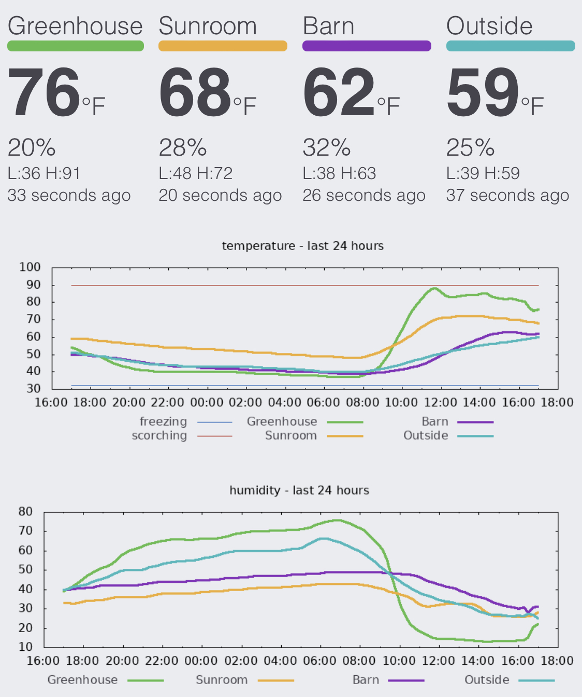

# Climate 

A PostgreSQL schema for time series climate sensor data.



## Installing

Clone this repo, desginate a PostgreSQL database, and execute the install make
target.

```bash
PGUSER=joshb PGDATABASE=fishpoopfarms make install
```

## Populating

Pass `climate.add_datum()` a JSON object with your data.  Timestamp is an
optional second argument.  A probe MAC address is required.

```sql
SELECT climate.add_datum(jsonb_build_object(
	'probe',      'DE:AD:BE:EF:CA:FE',
	'temp',       42.213,
	'humidity',   55.5
))
```

## Authors

* **Josh Byard** - *Initial work* - [jbyard](https://github.com/jbyard)
